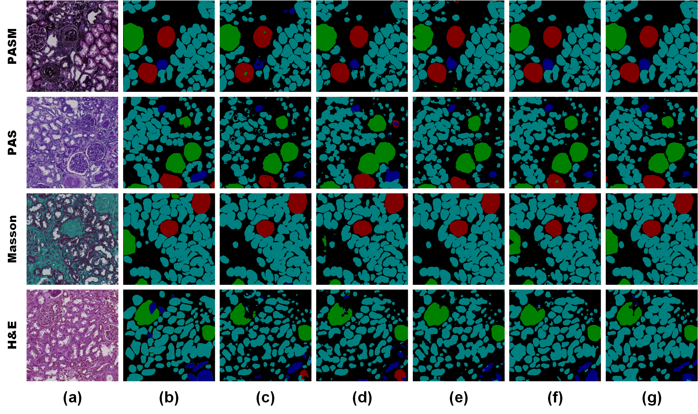

# MSMTSeg: Multi-Stained Multi-Tissue Segmentation of Kidney Histology Images via Generative Self-Supervised Meta-Learning Framework
 **[Xueyu Liu](https://scholar.google.com.hk/citations?user=jeatLqIAAAAJ&hl=zh-CN), Rui Wang, Yexin Lai, Yongfei Wu, Hangbei Cheng, Yuanyue Lu, Jianan Zhang, Ning Hao, Chenglong Ban, Yanru Wang, Shuqin Tang, Yuxuan Yang, Ming Li, Xiaoshuang Zhou and Wen Zheng** 

We present a generative self-supervised meta-learning framework to implement multi-stained multi-tissue segmentation, namely MSMTSeg, from renal biopsy WSIs using only a few annotated samples for each stain domain. MSMTSeg consists of multiple stain transform models for achieving inter-translation between multiple stain domains, a self-supervision module to obtain a pre-trained weight with individual information for each stain, and a meta-learning strategy combined with generated virtual data and the pre-trained weights to learn the common information across multiple stain domains and improve segmentation performance. 

## Acknowledgement
Thanks [Cycle-Gan](https://github.com/junyanz/CycleGAN), [MoCov3](https://github.com/CupidJay/MoCov3-pytorch), [MAML](https://github.com/dragen1860/MAML-Pytorch), [Unet]([https://github.com/aim-uofa/Matcher](https://github.com/milesial/Pytorch-UNet)). for serving as building blocks of MSMTSeg.
